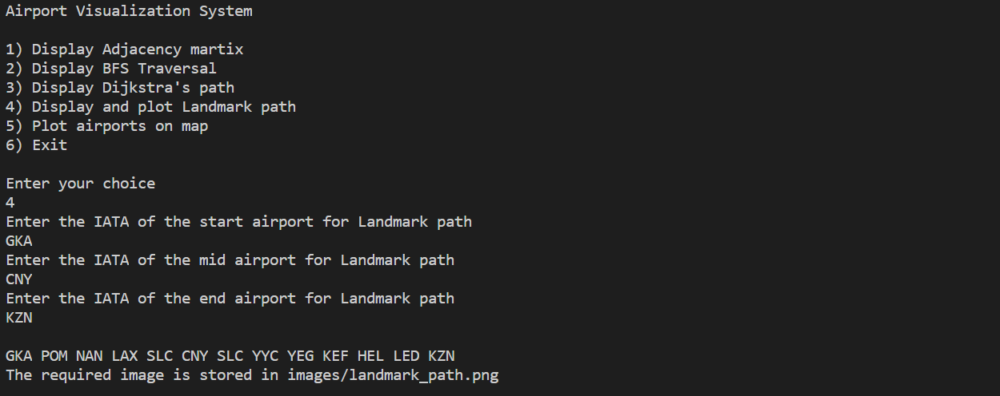

# CS 225 Final Project: OpenFlights

#### Authors : 

- Aniruddha G Pai (NET ID: agpai2)
- Nikil Ravi (NET ID: nikilr2)
- Tejesh Bhaumik (NET ID: tejeshb2)

## Dataset

We used the [OpenFlights](https://openflights.org/data.html) dataset for our project. This is an open source data set of flights routes and airports. The OpenFlights Airports Database contains over 10,000 airports spanning the globe. We extracted the data from the database to obtain the airports and routes in order to create and define a Graph ADT using an adjacency matrix.

## Project

This project involves the analysis of the OpenFlights dataset. 

Our project builds a graph from this dataset using an adjacency matrix. We then allow the user to implement different algorithms, including breadth-first traversal, Djikstra's Algorithm and Landmark Path Algorithm. The user can also choose to display the airports, as well as the output of the landmark path algorithm, on a world map.

The code has also been tested using the Catch testing framework.

## Installation

1. If you don't have a text-editor or an IDE, [download Visual Studio Code](https://code.visualstudio.com/download). Once downloaded, install necessary packages related to C++.
2. Other text-editors or IDEs like [Atom](https://atom.io/) or [Nano](https://www.nano-editor.org/download.php) can also be   used.
3. Clone this repository using git clone https://github-dev.cs.illinois.edu/cs225-fa20/tejeshb2-agpai2-nikilr2.git
4. Run the project from your system.

## Instructions for Build and Run

:warning: Follow the steps for installation, if necessary, before the building and running the program.

:warning: Please ensure that the [airports](https://raw.githubusercontent.com/jpatokal/openflights/master/data/airports.dat)  and [routes](https://raw.githubusercontent.com/jpatokal/openflights/master/data/routes.dat) dataset are downloaded and stored as **.csv file** in the **data** folder in your local working directory before the build and run of the program.

Our project contains two executable files namely - **main** and **test**. The **main** executable will parse through the data sets that are provided as an input and it will create and define a Graph ADT on it. To make and run **main** executable:

1. Make and compile the executable using **make** command in the console/terminal.
2. Then, enter ./main data/airports.csv data/routes.csv in the console/terminal.
3. On entering the above commands, the user will be provided with a list of options to perform any operations on the Graph ADT. The user would have have to select an operation by providing the corresponding number associated with that operation.
4. The example of its usage is as follows:

5. After each operation is performed, the list of options reappear to offer the user to perform more operations with the Graph ADT. Once the user is satisfied, the user can exit the program by entering **6** from the menu.

The test executable is the executable file that compiles and runs our test cases. To make and run the **test** executable:
1. Make and compile the executable using **make test** command followed by **./test** in the console/terminal.
2. The executable will then run our test cases. 

## Output format
We provide two types of output to the users: 

1. **PNG graphical projection** - If the user chooses to plot the landmark path or all the airports, the output is saved and stored in a .png file in the images folder. The airport locations are marked in orange and the path is marked in pink.
2. **Terminal Output** - If the user chooses to display the adjacency matrix, BFS traversal, or Dijkstra's path, the output will be provided through the console/terminal.
