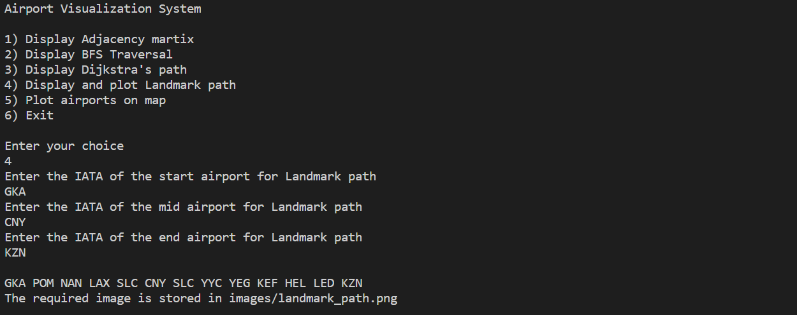

# CS 225 Final Project Report: OpenFlights

#### Author : 

- Aniruddha G Pai (NET ID: agpai2)
- Nikil Ravi (NET ID: nikilr2)
- Tejesh Bhaumik (NET ID: tejeshb2)

---
## Project Description
This project involves the analysis of the OpenFlights dataset. This is an open source data set of flights routes and airports. (
The OpenFlights Airports Database contains over 10,000 airports spanning the globe.
The data we have used can be found here:
[OpenFlights](https://openflights.org/data.html))

Our project builds a graph from this dataset using an adjacency matrix. We then allow the user to implement different algorithms, including breadth-first traversal, Djikstra's Algorithm and Landmark Path Algorithm. The user can also choose to display the airports, as well as the output of the landmark path algorithm, on a world map.

We have also tested our code using the Catch testing framework.

## Outputs/Results

To run the code, the user has to use the 'make' command, followed by './main datafile1.csv datafile2.csv'. This compiles the code and builds the graph. Once this is done, the program immediately displays a menu that allows the user to choose which algorithm they want to run. The user is then further prompted to enter their choice, and then asked for the inputs corresponding to their choice. For instance, if the user chooses Djikstra's algorithm, they will then be asked to provide the 3-letter IATA codes for the start and end airports.

In the case of the Landmark path algorithm, the code generates, in addition to the console output, an image of the world map in which the computed path has been plotted.

 

Here are also some of the console outputs of our other algorithms. (In the case of the breadth-first traversal and adjacency matrix display functionality, the output is rather large and therefore, we have not included an image here.)

We have used an adjacency matrix to store the information pertaining to our graph. Because of this choice, our code runs efficiently, taking no more than a couple of seconds to read and analyse and output the results for a graph containing thousands of airports and even more routes (edges).

